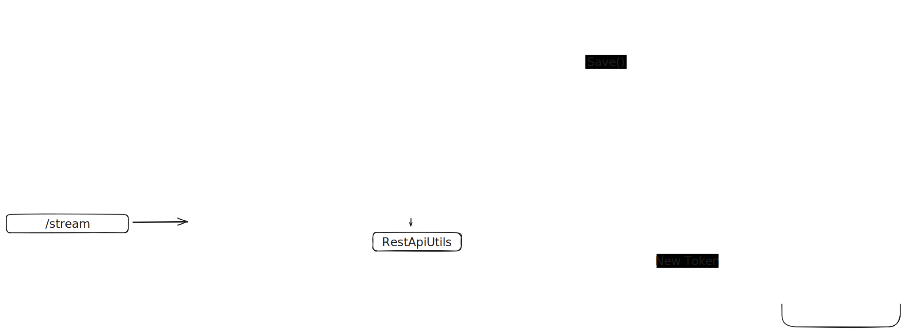

<br/>
<p align="center">
    <a href="https://github.com/ad/domru/blob/master/LICENSE" target="_blank">
        
    </a>
    <a href="https://github.com/ad/domru/actions" target="_blank">
        
    </a>
</p>

**moleus/domru** is a fork of [ad/domru](https://github.com/ad/domru).

## Breaking changes
This version **is not compatible** with ad/domru, the last compatible version is [0.1.6-dev.0](https://github.com/users/moleus/packages/container/domru/218322867?tag=0.1.6-dev.0)

New code structure and API is instroduced in PR [#13](https://github.com/moleus/domru/pull/13)

## Overview

This is a simple reverse proxy which adds authentication token to requests to domru API.

Also provides a simple web interface to view camera snapshots and open doors

## Run in Docker
Find available docker images here: https://github.com/moleus/domru/pkgs/container/domru
Please, don't use `latest` tag, because new update can break your setup

```shell
docker run --name moleus/domru:%docker-tag% --rm -p 8080:8080 -v $(pwd)/accounts.json:/share/domofon/accounts.json moleus/domru:latest
```

## In Kubernetes
AFAIK refresh token doesn't expire, so we can store it in a secret and use it in the deployment.

And we need only 2 parameters to get all other credentials: operatorId and refresh token
```yaml
apiVersion: v1
kind: Secret
metadata:
  name: domru-secrets
  namespace: "{{ k8s_domru_namespace }}"
type: Opaque
data:
  refresh: "{{ domru_refresh | b64encode }}"
  operator: "{{ domru_operator | b64encode }}"
```

```yaml
apiVersion: apps/v1
kind: Deployment
metadata:
  name: domru
  namespace: "{{ k8s_domru_namespace }}"
spec:
  replicas: 1
  selector:
    matchLabels:
      app: domru
  template:
    metadata:
      labels:
        app: domru
    spec:
      containers:
        - name: domru
          image: "{{ domru_image_name }}:{{ domru_image_tag }}"
          imagePullPolicy: IfNotPresent
          ports:
            - containerPort: 80
          env:
            - name: DOMRU_REFRESH_TOKEN
              valueFrom:
                secretKeyRef:
                  name: domru-secrets
                  key: refresh
            - name: DOMRU_OPERATOR_ID
              valueFrom:
                secretKeyRef:
                  name: domru-secrets
                  key: operator
            - name: DOMRU_PORT
              value: "80"
```

## Authentication

open http://localhost:8080/

1. You can use your phone number and confirmation code from sms to login
2. You can use login and password

## Custom API endpoints

This application provides the following endpoints

| Endpoint               | Method   | Description       |
|------------------------|----------|-------------------|
| `/`, `pages/home.html` | GET      | Home Page         |
| `/login`               | GET      | Login Page        |
| `/stream/{cameraId}`   | GET      | View video stream |
| `/login`               | GET/POST | Login             |

## Domru API endpoints

All other requests are forwarded to Domru API. A few of them:

| Endpoint                                                                    | Method | Description        |
|-----------------------------------------------------------------------------|--------|--------------------|
| `/rest/v1/forpost/cameras`                                                  | GET    | Get cameras list   |
| `/rest/v1/places/{placeId}/accesscontrols/{accessControlId}/actions`        | POST   | Open door          |
| `/rest/v1/subscribers/profiles/finances`                                    | GET    | Get finances       |
| `/rest/v1/subscribers/profiles`                                             | GET    | Get profile info   |
| `/rest/v1/subscriberplaces`                                                 | GET    | Get places         |
| `/rest/v1/places/{placeId}/accesscontrols/{accessControlId}/videosnapshots` | GET    | Get video snapshot |
| `/rest/v1/forpost/cameras/{cameraId}/video`                                 | GET    | Get video stream   |
| `/auth/v2/session/refresh`                                                  | GET    | Get new token      |
| `/rest/v1/places/{placeId}/events?allowExtentedActions=true`                | GET    | Get events         |
| `/public/v1/operators`                                                      | GET    | List of operators  |
| `/auth/v2/login/{phone}`                                                    | GET    | Get accounts       |
| `/auth/v2/confirmation/{phone}`                                             | POST   | Confirm sms code   |

## 🤝&nbsp; Found a bug? Missing a specific feature?

Feel free to **file a new issue** with a respective title and description on
the [moleus/domru](https://github.com/moleus/domru/issues) repository. If you already found a solution to your problem,
**we would love to review your pull request**!

## Development

Setup pre-commit hooks
```bash
pip install pre-commit
pre-commit install
pre-commit run --all-files
```

setup dependencies
```bash
go install
go mod tidy
```

### Application architecture



## 📘&nbsp; License

Released under the terms of the [MIT License](LICENSE).
