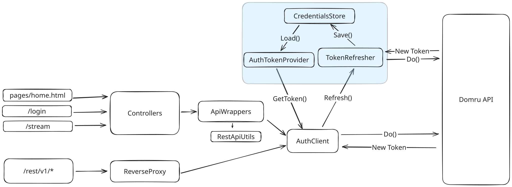

**moleus/domru** is a fork of [ad/domru](https://github.com/ad/domru).

## Breaking changes
This version **is not compatible** with ad/domru, the last compatible version is [0.1.6-dev.0](https://github.com/users/moleus/packages/container/domru/218322867?tag=0.1.6-dev.0)

New code structure and API is instroduced in PR [#13](https://github.com/moleus/domru/pull/13)

## Overview

This is a simple reverse proxy which adds authentication token to requests to domru API.

Also provides a simple web interface to view camera snapshots and open doors

The home page lists your own intercoms and, when the operator exposes
`/rest/v1/places/{placeId}/screen-sections`, cameras of neighboring entrances.
Neighboring cameras are viewable only with an active Pro subscription; otherwise
their cards say so. Cameras are matched by camera/group IDs rather than list
order, and the "Open door" button is shown only for your own access controls
(taken from `/rest/v1/places/{placeId}/accesscontrols` with `allowOpen`). If the
extra endpoints fail or return 404, the basic camera list is still rendered.
Every card comes with its own Home Assistant snippet; merge them under a single
`camera:` / `rest_command:` section.

## Run in Docker
Find available docker images here: https://github.com/moleus/domru/pkgs/container/domru
Please, don't use `latest` tag, because new update can break your setup

```shell
docker run --name domru --rm -p 8080:8080 -v $(pwd)/accounts.json:/share/domofon/accounts.json moleus/domru:%docker-tag%
```

## In Kubernetes
AFAIK refresh token doesn't expire, so we can store it in a secret and use it in the deployment.

And we need only 2 parameters to get all other credentials: operatorId and refresh token
```yaml
apiVersion: v1
kind: Secret
metadata:
  name: domru-secrets
  namespace: "{{ k8s_domru_namespace }}"
type: Opaque
data:
  refresh: "{{ domru_refresh | b64encode }}"
  operator: "{{ domru_operator | b64encode }}"
```

```yaml
apiVersion: apps/v1
kind: Deployment
metadata:
  name: domru
  namespace: "{{ k8s_domru_namespace }}"
spec:
  replicas: 1
  selector:
    matchLabels:
      app: domru
  template:
    metadata:
      labels:
        app: domru
    spec:
      containers:
        - name: domru
          image: "{{ domru_image_name }}:{{ domru_image_tag }}"
          imagePullPolicy: IfNotPresent
          ports:
            - containerPort: 80
          env:
            - name: DOMRU_REFRESH_TOKEN
              valueFrom:
                secretKeyRef:
                  name: domru-secrets
                  key: refresh
            - name: DOMRU_OPERATOR_ID
              valueFrom:
                secretKeyRef:
                  name: domru-secrets
                  key: operator
            - name: DOMRU_PORT
              value: "80"
```

## Authentication

open http://localhost:8080/

1. You can use your phone number and confirmation code from sms to login
2. You can use login and password

## Custom API endpoints

This application provides the following endpoints

| Endpoint               | Method   | Description       |
|------------------------|----------|-------------------|
| `/`, `pages/home.html` | GET      | Home Page         |
| `/login`               | GET      | Login Page        |
| `/stream/{cameraId}`   | GET      | View video stream |
| `/login`               | GET/POST | Login             |

## Domru API endpoints

All other requests are forwarded to Domru API. A few of them:

| Endpoint                                                                    | Method | Description        |
|-----------------------------------------------------------------------------|--------|--------------------|
| `/rest/v1/forpost/cameras`                                                  | GET    | Get cameras list   |
| `/rest/v1/places/{placeId}/screen-sections`                                  | GET    | Additional camera sections and subscription access |
| `/rest/v1/places/{placeId}/accesscontrols/{accessControlId}/snapshots`        | GET    | Camera snapshot, including authorized neighboring entrances |
| `/rest/v1/places/{placeId}/accesscontrols/{accessControlId}/actions`        | POST   | Open door          |
| `/rest/v1/subscribers/profiles/finances`                                    | GET    | Get finances       |
| `/rest/v1/subscribers/profiles`                                             | GET    | Get profile info   |
| `/rest/v1/subscriberplaces`                                                 | GET    | Get places         |
| `/rest/v1/places/{placeId}/accesscontrols/{accessControlId}/videosnapshots` | GET    | Get video snapshot |
| `/rest/v1/forpost/cameras/{cameraId}/video`                                 | GET    | Get video stream   |
| `/auth/v2/session/refresh`                                                  | GET    | Get new token      |
| `/rest/v1/places/{placeId}/events?allowExtentedActions=true`                | GET    | Get events         |
| `/public/v1/operators`                                                      | GET    | List of operators  |
| `/auth/v2/login/{phone}`                                                    | GET    | Get accounts       |
| `/auth/v2/confirmation/{phone}`                                             | POST   | Confirm sms code   |

## Intercom call notifications: SIP, webhook, Telegram (experimental)

Optional components, all disabled by default. They watch **one** intercom,
notify about incoming calls and offer a door button whose call-ending mode is
still under evaluation (`off` today: it only opens the door). Details and the
test plan live in `decisions/003-sip-webhook-integration.md` (local file).

| Variable | Meaning |
|---|---|
| `DOMRU_SIP_ENABLED` | `true` registers a SIP client for the intercom below |
| `DOMRU_SIP_IP`, `DOMRU_SIP_PORT` | LAN IPv4 the operator can reach and UDP port (default `5060`); use host networking |
| `DOMRU_SIP_RTP_FIRST`, `DOMRU_SIP_RTP_LAST` | UDP range for the receive-only RTP sink (default `20000`–`20100`) |
| `DOMRU_SIP_PLACE_ID`, `DOMRU_SIP_ACCESS_CONTROL_ID` | The intercom; verified against `/accesscontrols` on start |
| `DOMRU_SIP_END_MODE` | `off` (default, open only), `reject` (486 after opening; does not stop the panel) or `answer-bye` (200/ACK, open, BYE; the only mode verified to silence the panel) |
| `DOMRU_SIP_DIAGNOSTICS`, `DOMRU_SIP_DIAGNOSTICS_TOKEN` | Enable per-call actions below; token of 24+ characters |
| `DOMRU_WEBHOOK_URL` | POST `{"event":"Ringing"}` with an `Idempotency-Key` per call |
| `DOMRU_TELEGRAM_BOT_TOKEN`, `DOMRU_TELEGRAM_CHAT_ID` | Dedicated bot and numeric id of one private chat or group |
| `DOMRU_TELEGRAM_VIDEO` | `true` follows every photo with a 30 s MP4 (15 s before and after the call) cut from the operator's cloud archive, falling back to an in-memory live buffer when the tariff has no recording; `buffer` uses the live buffer only |

State files next to `accounts.json`: `sip-installation-id` (stable SIP device id)
and `telegram-state.json` (button bindings, update offset, callback results;
mode `0600`). Keep the directory on a persistent volume so old buttons survive
restarts. See `docker-compose.sip.yml` for a host-network example.

Endpoints:

| Endpoint | Method | Description |
|---|---|---|
| `/api/integrations/state` | GET | SIP, Telegram and webhook status without credentials |
| `/api/places/{placeId}/accesscontrols/{accessControlId}/open-and-end-call` | POST | Open the configured intercom and end the current call in the selected mode; without a call it just opens. The home page button and HA snippet of that intercom use it automatically. `409` while another opening runs |
| `/api/sip/calls/{callId}/reject`, `/api/sip/calls/{callId}/answer-bye` | POST | Diagnostics only, `Authorization: Bearer <token>` |

The response of `open-and-end-call` carries two fields: `opening`
(`accepted`, `unknown`, `failed`, `busy`) and `call` (`off`, `ended`, `absent`,
`failed`, `not_attempted`). `accepted` means the operator API took the command,
not that the door physically opened. The command is never retried on its own.

Telegram setup: create a bot with `@BotFather`, then either send it `/start`
in a private chat or add it to a group. Get the numeric chat id from
`https://api.telegram.org/bot<token>/getUpdates` after a message in that chat
(group ids are negative). In a group every member may press the button. The
bot uses long polling, so a bot with a configured webhook is rejected; use a
dedicated bot. A missing snapshot yields a text notification with the same
button. The button never expires and may be pressed again later; it always
refers to the call it was sent for and never ends a newer call.

With `DOMRU_TELEGRAM_VIDEO=true` the bot also replies to the photo with a short
clip about 15–20 s after the call. Nothing is written to disk: the operator
keeps a continuous cloud recording per camera and plays it back from any
moment (`/video?TS=<unix seconds>`), so the seconds before the call are
already there. Tariffs without recording answer such a request with the live
stream instead; the bot detects that (once at startup and on every call) and
switches for good to a **live buffer**: a permanent connection to the camera's
light stream (960×528) keeps the last 20 s of frames in RAM (~1 MiB, no
decoding) and the clip is cut from it, including the seconds before the ring.
The call that triggered the switch still gets the seconds after it.
`DOMRU_TELEGRAM_VIDEO=buffer` skips the archive entirely. The buffer costs about
0.45 Mbit/s (~4 GB a day) around the clock. Either way the FLV is remuxed to MP4 in memory
(`github.com/yapingcat/gomedia`, pure Go). Clip errors only show up in
`/api/integrations/state`; the photo and the button are unaffected.

## 🤝&nbsp; Found a bug? Missing a specific feature?

Feel free to **file a new issue** with a respective title and description on
the [moleus/domru](https://github.com/moleus/domru/issues) repository. If you already found a solution to your problem,
**we would love to review your pull request**!

## Development

Setup pre-commit hooks
```bash
pip install pre-commit
pre-commit install
pre-commit run --all-files
```

setup dependencies
```bash
go install
go mod tidy
```

### Application architecture



## 📘&nbsp; License

Released under the terms of the [MIT License](LICENSE).
